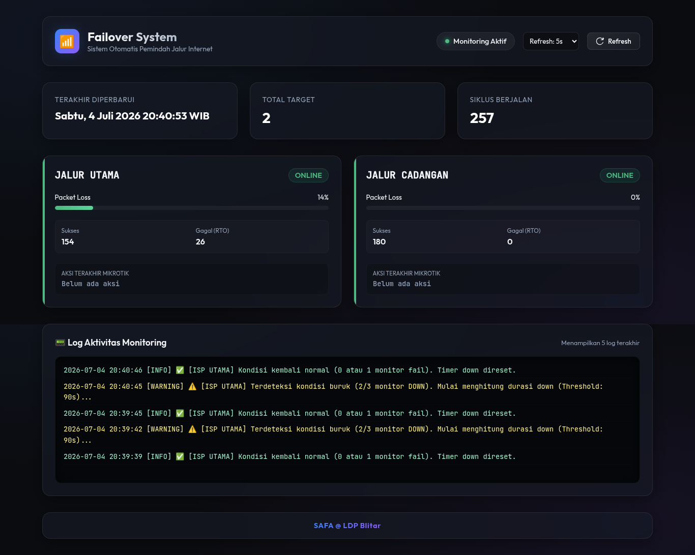
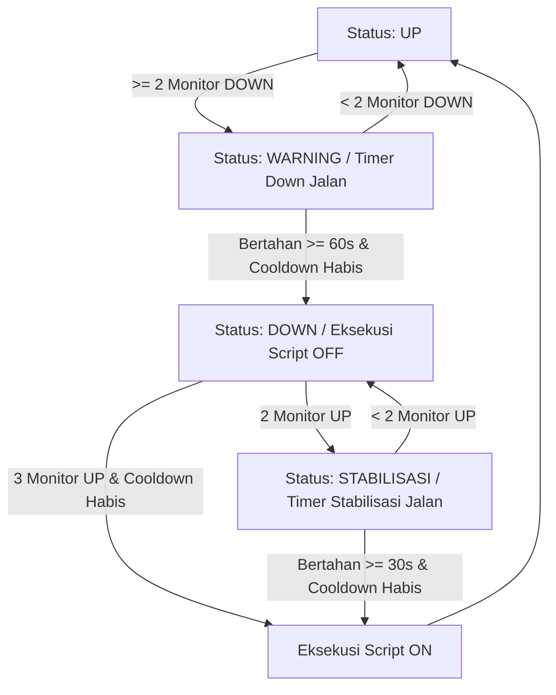

# Sistem Failover Monitoring Ping & Web Dashboard Mikrotik (Smart Version) 🚀

Aplikasi Python super tangguh, cerdas, dan responsif untuk memantau stabilitas jalur koneksi internet (failover) pada router Mikrotik secara real-time. Aplikasi ini menggunakan metode ping paralel ke beberapa monitor IP per ISP, mengevaluasi status jaringan tiap detik dengan **State Machine Real-time**, serta dilengkapi dengan perlindungan **Anti-Flapping (Cooldown)** agar router lu gak meriang gara-gara gonta-ganti jalur terus!

---

## 📸 Screenshots & Workflow

### 1. Aliran Logika Failover (State Machine)


### 2. Tampilan Web Dashboard (Glassmorphism Dark Mode)


---

## 🌟 Fitur Utama

* **⚡ Ping Paralel Multi-IP**: Memantau beberapa IP sekaligus per target ISP menggunakan `ThreadPoolExecutor` secara bersamaan setiap detik. Gak ada lagi cerita salah vonis ISP mati cuma gara-gara satu DNS Google doang yang RTO!
* **🧠 Logika Failover Cerdas (State Machine)**:
  * **Rule 1 (Single failure di-ignore)**: Kalau cuma 1 monitor IP yang DOWN, jalur dianggap masih aman (Status: `OK`).
  * **Rule 2 (Majority failure)**: Minimal 2 dari 3 monitor IP wajib DOWN baru dianggap kondisi buruk (Status: `WARNING`).
  * **Rule 3 (Duration requirement)**: Kondisi buruk harus bertahan $\ge$ 60-90 detik (default: `60s`) secara konsisten baru status resmi ISP beralih ke `DOWN` dan memicu script penonaktifan rute Mikrotik.
* **🛡️ Anti-Flapping Protection (Cooldown)**:
  * Setelah terjadi failover (jalur dialihkan), sistem akan mengunci status resmi dan memblokir perpindahan balik (switch back) selama **180 detik** biar gak terjadi efek ping-pong/flapping koneksi yang bikin pusing.
* **🔄 Fase Stabilisasi & Recovery Cerdas**:
  * **3 Monitor Aktif**: Jalur langsung dianggap pulih (`ISP UP`) secara instan (jika cooldown sudah selesai).
  * **2 Monitor Aktif**: Jalur masuk ke fase **STABILISASI**. Kondisi ini harus bertahan selama $\ge$ `30s` baru dianggap pulih sepenuhnya.
  * **1 Monitor Aktif**: Di-ignore (jalur tetap dianggap mati).
* **📊 Moving Average Packet Loss**:
  * Menggunakan sliding window `deque` (60 detik terakhir) untuk menghitung statistik packet loss secara dinamis dan menampilkannya dalam bentuk progress bar visual yang halus di dashboard.
* **🎨 Web Dashboard Transisi Visual**:
  * Skema warna Glassmorphism Dark Mode dengan animasi heartbeat detak dinamis sesuai status transisi:
    * 🟢 `ONLINE` (Hijau)
    * 🟡 `WARNING` (Kuning Amber) - Menunggu timer down
    * 🔵 `STABILISASI` (Biru) - Menunggu timer pulih
    * 🔴 `RTO / DOWN` (Merah)

---

## ⚙️ Detail Aliran Logika (State Machine Diagram)



---

## 🛠️ Persyaratan Sistem

| Komponen | Persyaratan Minimum | Keterangan |
| :--- | :--- | :--- |
| **Python** | Versi 3.8 ke atas | Dibutuhkan untuk menjalankan engine monitoring dan web server |
| **Router Mikrotik** | RouterOS v6/v7 | Fitur **API** harus diaktifkan (default port: `8728`) |
| **Hak Akses User** | `write` & `read` | Dibutuhkan user API Mikrotik untuk menjalankan script ON/OFF |
| **Library Python** | Tertera di `requirements.txt` | Di antaranya `routeros-api` dan `python-dotenv` |

---

## 📂 Struktur Direktori Proyek

```text
mikrotik-sistem-failover/
├── ping_monitor.py      # Script utama (Engine monitoring & Web Server)
├── index.html           # File UI Web Dashboard (Glassmorphism design)
├── requirements.txt     # Daftar dependency Python
├── .env                 # File konfigurasi environment (kredensial & port)
├── screenshot/          # Folder dokumentasi gambar alur & dashboard
│   ├── alur.png
│   └── aplikasi.png
└── systemd/             # Script untuk deploy sebagai daemon service
    ├── install.sh
    └── ping-monitor.service
```

---

## 📥 Cara Instalasi

Ikuti langkah-langkah di bawah ini untuk memasang aplikasi di sistem Ubuntu Anda:

### 1. Masuk ke Direktori Proyek
```bash
cd /home/safa/jaringan/aplikasi/mikrotik-sistem-failover
```

### 2. Aktifkan Virtual Environment (Opsional/Direkomendasikan)
```bash
source ../../bin/activate
```

### 3. Install Dependensi Python
```bash
pip install -r requirements.txt
```

---

## ⚙️ Cara Konfigurasi

### 1. File Konfigurasi Lingkungan (`.env`)
Buat atau ubah file `.env` di root direktori proyek Anda dan sesuaikan isinya:

```env
MIKROTIK_IP=10.10.3.1        # IP Address Router Mikrotik Anda
MIKROTIK_USER=sistem         # Username dengan hak akses API Mikrotik
MIKROTIK_PASSWORD=sistem     # Password user API Mikrotik
MIKROTIK_API_PORT=8728       # Port API Mikrotik (default: 8728)
WEB_PORT=31337                # Port untuk mengakses Web Dashboard
```

> [!IMPORTANT]
> Pastikan username dan password di atas sudah memiliki hak akses yang cukup di Mikrotik untuk menjalankan script.

### 2. Konfigurasi Target & Script Mikrotik
Di dalam file `ping_monitor.py`, parameter IP monitor dan script diatur sebagai berikut:

```python
TARGETS = {
    "target1": {
        "name": "ISP UTAMA",
        "ips": ["8.8.8.8", "1.1.1.1", "9.9.9.9"],
        "script_off": "JALUR_LDP_OFF", # Dijalankan ketika target1 DOWN
        "script_on":  "JALUR_LDP_ON",  # Dijalankan ketika target1 UP kembali
    },
    "target2": {
        "name": "ISP BACKUP",
        "ips": ["8.8.4.4", "1.0.0.1", "149.112.112.112"],
        "script_off": "JALUR_BACKUP_OFF",
        "script_on":  "JALUR_BACKUP_ON",
    },
}
```

---

## 🏃‍♂️ Cara Menjalankan

### Menjalankan Secara Manual (Development Mode)
Jalankan program utama menggunakan Python:

```bash
python ping_monitor.py
```

Setelah program berjalan:
1. **Log Terminal**: Terminal akan menampilkan log status ping paralel secara ringkas per detik, lengkap dengan indikator status transisi dan sisa waktu cooldown global.
2. **Web Dashboard**: Buka browser Anda dan akses dashboard di: **`http://localhost:8080`** (sesuaikan port jika Anda menggantinya di file `.env`).
3. **Auto-refresh**: Dashboard akan diperbarui secara otomatis setiap detik tanpa membebani browser.

---

## 🔄 Konfigurasi Daemon (Systemd Service)

Agar aplikasi dapat berjalan otomatis secara terus-menerus di latar belakang dan menyala secara otomatis saat booting OS, lu bisa setup service systemd:

### 1. Masuk ke Folder Systemd
```bash
cd systemd
```

### 2. Jalankan Script Instalasi
```bash
sudo ./install.sh
```

### 3. Perintah Manajemen Service

* **Melihat status service**:
  ```bash
  sudo systemctl status ping-monitor.service
  ```
* **Melihat log aktivitas secara real-time**:
  ```bash
  sudo journalctl -u ping-monitor.service -f
  ```
* **Restart service**:
  ```bash
  sudo systemctl restart ping-monitor.service
  ```
* **Stop service**:
  ```bash
  sudo systemctl stop ping-monitor.service
  ```
